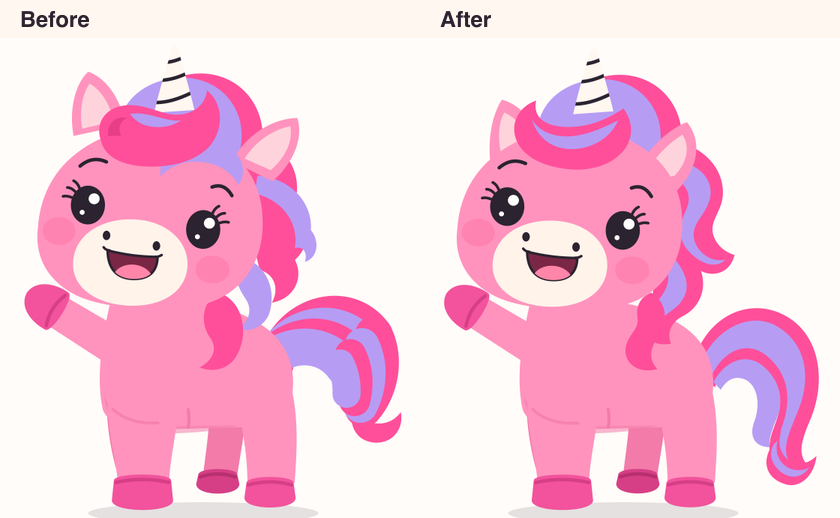

# Sparkle's shared character



`src/sdk/puppet/Sparkle.tsx` is the single live drawing. All four countries use it directly
or through shared story/stamp components. The older `Mascot` API wraps it for the shell,
passport, video controls, trophy ceremony and unicorn tea party. Its square `size` layout
and `wave` / `cheer` / `think` expressions remain compatible with existing callers.
New games should use `SparklePuppet` and its awaitable actions.

Keep her pink body, cream muzzle, striped horn, large dark eyes and pink/lavender hair.
This is vector artwork: edit the shared SVG instead of generating another live character.

## Joints and hair

- Ear pivots sit inside the skull at `(318, 266)` and `(584, 302)`. Broad ear bases overlap
  the head behind its silhouette. Rotate at these roots; never move the ears alongside the head.
- Mane, crown, horn, forelock and ears all belong to the head transform. Hair can have
  spring follow-through within that group. Clamp spring angles so the overlap stays hidden.
- The mane and tail each have continuous silhouettes with inset lavender bands. Avoid
  assembling hair from disconnected wedges or stacks of thick round-ended strokes.
- Mirroring, turning toward a friend and snorkel equipment use the same drawing.
- Mouth clip IDs are unique per instance so multiple Sparkles can speak without interfering.

## Review and references

Build and start a dedicated preview, then run the Safari review:

```sh
npm run typecheck
npm run build
npm run preview -- --port 4185 --strictPort
# In another terminal:
node scripts/qa-sparkle.mjs --export-reference
npm run test
```

`qa-output/sparkle/` contains screenshots at four iPad and three iPhone sizes, mirrored
and snorkel views, representative country scenes and filmstrips of all seven actions,
repeated three times. Inspect ear connections, hair joins, silhouette, expression and
scene fit. The lab can scroll on short phones; actual play scenes must fit their screens.
The script accepts `--base=` if the dedicated preview uses another port.

`tests/sparkle.spec.ts` checks the menu adapter, clip isolation and filled ear-base geometry
through three repetitions of every action. To run that test in Safari, use Playwright's
WebKit browser option. Automated geometry checks supplement visual inspection.

The export option refreshes the three tracked PNGs in `art/source/mascot/` and their
WebP counterparts in `src/assets/mascot/` from the live puppet's resting poses. Generated
cover/background illustrations may contain a painted Sparkle; they are illustrations,
not alternative live components. Use the refreshed reference for new illustrations.
Changing the shared SVG does not repaint characters embedded in existing scene artwork.
