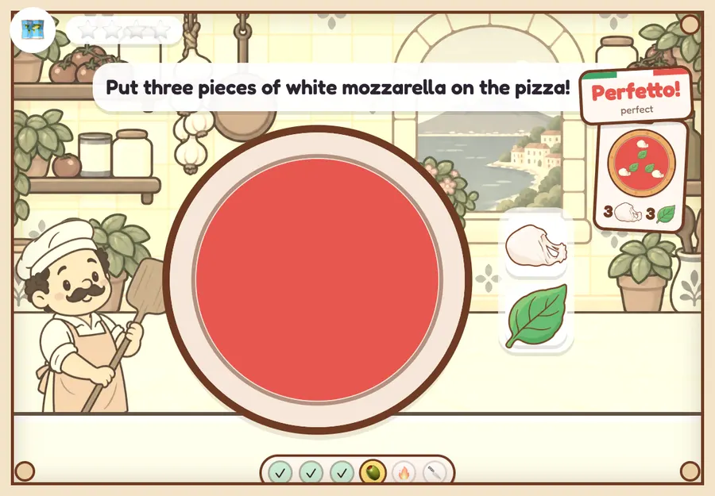
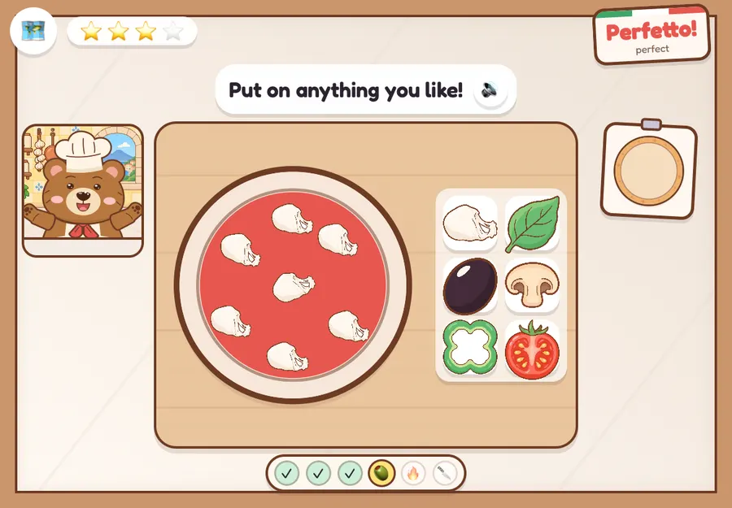
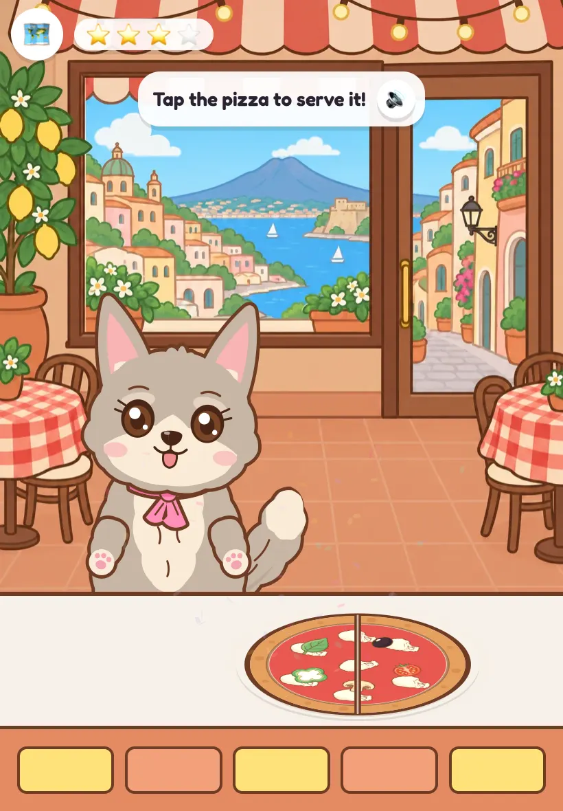

# Pizzeria visual QA

Reviewed in WebKit with touch input at 820×1180, 1180×820, 1024×1366 and 1366×1024.

| Finding | Fix |
| --- | --- |
| Overhead pizza floats across a front-facing kitchen wall | Marble worktop and wooden prep board viewed from overhead; the chef appears in a separate kitchen window |
| Raw pizza and peel face the viewer vertically | Project both together onto the same angled plane |
| Served pizza straddles the counter top and counter front | Deeper tabletop, flatter pizza, and a highlight that follows the pizza's plane |
| Italian word card covers instructions and replay | Move it into the clear top-right space |
| Storybook border clips the station bar | Raise the station bar inside the frame |
| Dough toss crosses the instruction area | Keep its flight within the workspace |
| Automatic cheese disappears on the olive and mushroom stations | Render non-selectable cheese underneath the interactive toppings |
| Rotating the iPad clears painted sauce but keeps its progress | Repaint stored fractional brush strokes on canvas resize |
| Landscape hides ingredients in a scrolling tray | A local two-column tray with all six 88px targets visible |
| Cesare covers the tray and finish control | Place the cat on the opposite side of the workspace |

The playthrough covered all four orders, dough, sauce, counted toppings, halves,
oven turns, cutting, serving, service transitions, and the earned stamp. The focused
exploratory pass covered a missed ingredient drop, partial sauce through rotation,
all six tray ingredients, Cesare stealing and returning cheese, a decorated pizza,
and serving in every listed viewport. Both completed without page errors.

Reviewed the dough in flight on each of its three tosses as well as settled screens.
The final iPad screenshots show no clipped ingredient controls, covered replay
button, or pizza crossing the serving counter's front edge. Audio quality and lip
sync still need listening on a physical iPad.

## Before: overhead pizza against a kitchen wall

## After: overhead workspace with all six ingredients

## After: pizza rests on the serving counter

